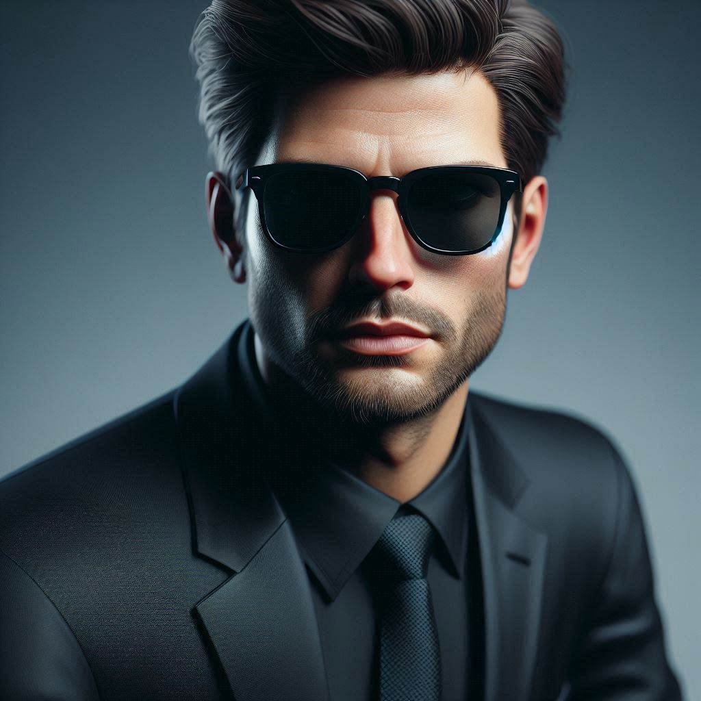

# Natural ou Fake Natty? Como Vencer na Era das IAs Generativas

## 📒 Descrição
Criação de video e foto na tentativa de se parecer ao maximo com a realidade.

## 🤖 Tecnologias Utilizadas

- [Copilot](https://copilot.microsoft.com/)
- [studio.d-id](https://studio.d-id.com/video-studio)

## 🧐 Processo de Criação
Copilot：

|  Ação  | prompt                                                                                 |
| :----: | -------------------------------------------------------------------------------------- |
| título | Crie uma imagem ultra realista de um home de terno pretoe oculos escuros.|

Studio.d-id:
Criação elaborada por passos, escolha de avatar, texto a ser falado e fundo do video.

## 🚀 Resultados

